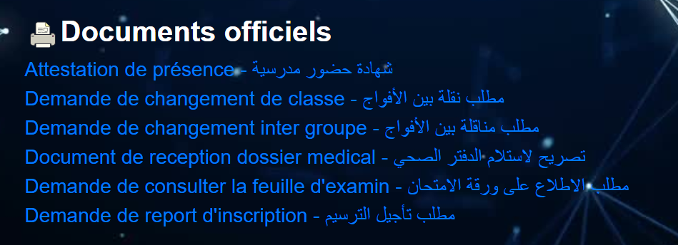
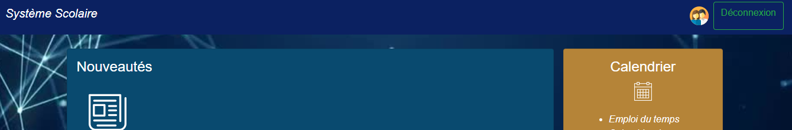
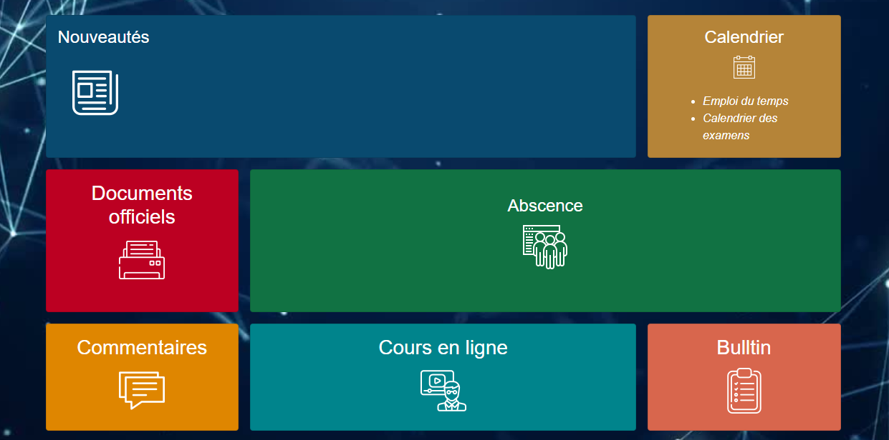

# School management platform
## REST based micro-services sample
Ten  Spring Boot based Maven projects that are standalone applications:
Stores (H2 , exposing a few Starbucks shops across north america, geo-spatial functionality)
Customers (JPA)
Customers UI (Angular and Spring Boot CLI backend)

## Tools & Versions
- Spring Boot Version: 1.5.8
- Spring Cloud Version 1.2.4
- Java Version 1.8.0_121
- Maven Version 3.5.2
- IntelliJ IDEA Version Ultimate 2016.1 (or any other IDE of your choice)
## communicate between microservices with Feign
Feign is an HTTP client that greatly facilitates the calling of APIs exposed by the various microservices. It is therefore able to create and execute HTTP requests based on the annotations and information provided. It is a bit like the code equivalent of Postman.
## Spring Cloud Config
Spring Cloud Config provides server-side and client-side support for externalized configuration in a distributed system. With the Config Server, you have a central place to manage external properties for applications across all environments. The concepts on both client and server map identically to the Spring Environment and PropertySource abstractions, so they fit very well with Spring applications but can be used with any application running in any language
## Spring Cloud Netflix
Spring Cloud Netflix provides Netflix OSS integrations for Spring Boot apps through autoconfiguration and binding to the Spring Environment and other Spring programming model idioms. With a few simple annotations, you can quickly enable and configure the common patterns inside your application and build large distributed systems with battle-tested Netflix components. The patterns provided include Service Discovery (Eureka).

## some graphical interfaces used in this project 

